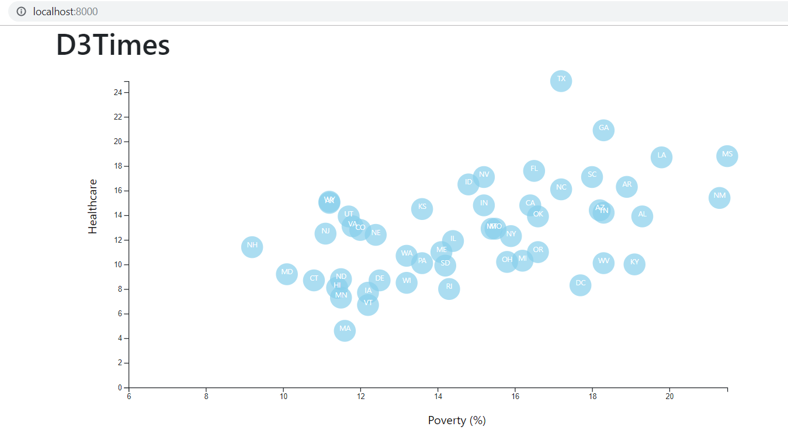

# Data Journalism and D3
##### Homework 16

## Objective
- Visualize [2014 ACS 1-year estimates](https://factfinder.census.gov/faces/nav/jsf/pages/searchresults.xhtml).  The dataset includes data on rates of income, obesity, poverty, etc. by state.
Data are visuzalized using D3. 

## Methodology
- Visualization is built in two level of difficulties: 
  Level 1 for basic visualization, and 
  Level 2 for multi-axis visualization. 

 ## Level 1
 In level 1, we insure that data integrity by manipulating and plotting a pair of data. In our example, we choose to look if there is a relationship between poverty and healthcare. 
    