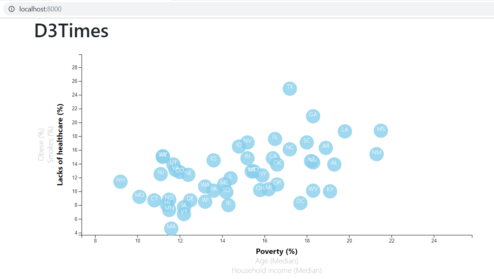

# Data Journalism and D3
##### Homework 16

## Objective
- Visualize [2014 ACS 1-year estimates](https://factfinder.census.gov/faces/nav/jsf/pages/searchresults.xhtml).  The dataset includes data on rates of income, obesity, poverty, etc. by state.
Data are visuzalized using D3. 

## Methodology
- Visualization is built in two level of difficulties: 
  Level 1 for basic visualization, and 
  Level 2 for multi-axis visualization. 

 ## Level 1
 In level 1, we insure that data integrity by manipulating and plotting a pair of data. In our example, we choose to look if there is a relationship between "poverty" and "healthcare". 
  
    
     

 ## Level 2
 In level 2, we will transform the static and basic Level1 graph into an interactive graph. We will integrate additional data from [2014 ACS 1-year estimates](https://factfinder.census.gov/faces/nav/jsf/pages/searchresults.xhtml), such as "Obesity", "Smoking rate", "Household income", and "Age". 
 The graph will be automatically by clicking on the axis label.
 
Default setting is set to "poverty" and "healthcare"
  
    
     

Example of graph for "Obesity" and "Household income" is shown below:
  
    
     
